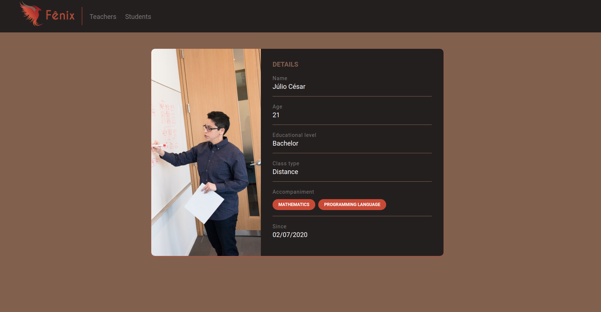

  

> An online and open source platform

  

# 📌 Table of Contents
- [About](#💬-About)
- [WARNING](#⚠️-WARNING)
- [Motivation](#💌-Motivation)
- [LICENSE](#📕-LICENSE)

# 💬 About
The Fênix project is a platform where its main objective is the connection between students and teachers.

A free platform, aiming at free knowledge and valuing teachers who want to make classes available to other students registered on the platform.

Unlike other study platforms, we offer teachers, not courses.

Where both (teacher and student) are totally free within the platform, our only goal is to connect them

# ⚠️ WARNING
The purpose of this project is for my personal study, unfortunately the Fênix is ​​not an application in the market

# 💌 Motivation
Our biggest motivation is in relation to Covid-19, with schools closed, teachers and students at home, the idea came up to create a completely online platform where teachers can exercise their occupation at home

# 📕 LICENSE

Under development. Released in 2020. This project is under the MIT License

Made with 💜 by Júlio César
